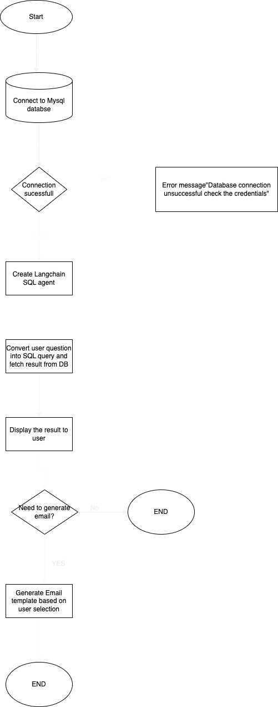

# **SQL Genie: Ask & Query!**

## Overview

SQL Genie is an interactive Streamlit-powered application that allows users to interact with a SQL database through natural language queries. The application utilizes an AI agent to generate SQL queries, execute them against a MySQL database, and return results in a user-friendly format. Additionally, SQL Genie can generate AI-driven email templates based on query results.

## Features

AI-Powered SQL Query Execution: Converts natural language questions into SQL queries and retrieves results.

Database Connectivity: Connects to a MySQL database using SQLAlchemy.

Query Processing and Validation: Ensures only relevant queries are executed.

Email Generation: Generates email templates based on SQL query results using OpenAI’s API.

Session State Management: Maintains query and result history to enhance user interaction.




## Prerequisites

To run SQL Genie, you need:

Python 3.8+
MySQL database
OpenAI API Key

## Installation

**Clone this repository:**

`git clone https://github.com/Sowmyatn1/AI-App-EmailGenerator.git`
`cd AI-App-EmailGenerator`

**Install dependencies:**

`pip install -r requirements.txt`

Create a .env file in the project directory and add your credentials:

OPENAI_API_KEY=your_openai_api_key
DB_host=your_database_host
DB_user=your_database_user
DB_password=your_database_password
DB_database=your_database_name
DB_port=your_database_port

**Run the application:**
`streamlit run sqlapp.py`

# **Project Structure**
```Python

sql-genie/
│── .env                         # Environment variables
│── sqlapp.py                    # Main Streamlit application
│── llm_agent.py                  # AI-powered SQL Agent
│── generate_email.py             # Email generation logic
│── requirements.txt              # Required Python library
```

## Usage

#### **1. Database Connection**

Click on Test Database Connection to ensure connectivity.

Upon success, the AI SQL agent is initialized.

#### **2. Query Execution**

Type a question related to the database (e.g., "How many customers ordered in the last month?").

Click Submit to execute the query.

The SQL query result is displayed.

#### **3. Email Generation**

If the query involves an email-related request, select the type of email from the dropdown (Discount, Product Recommendation, etc.).

Click Generate Email to receive an AI-generated email template based on the query result.

#### **Error Handling**

The app ensures database connection errors are properly handled.

It prevents SQL injection by restricting queries to predefined tables.

Provides clear warnings when required inputs are missing.

# **Dependencies**

streamlit
sqlalchemy
pymysql
langchain
python-dotenv
openai

# **Future Enhancements**

Support for additional databases (PostgreSQL, SQL Server)

Enhanced natural language processing for improved query understanding

More customizable email templates


